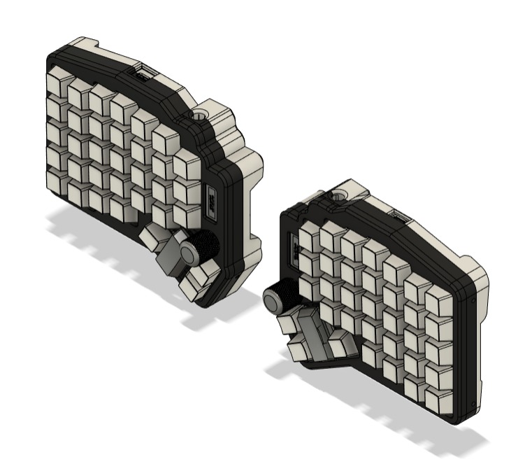
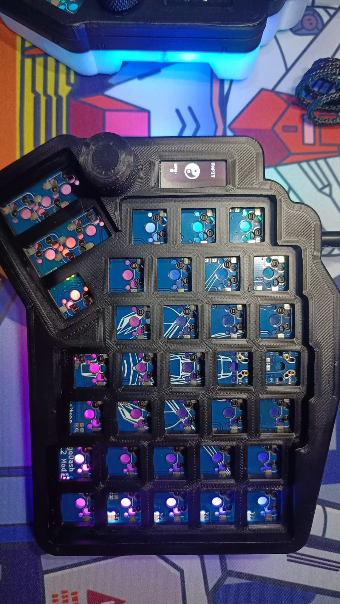
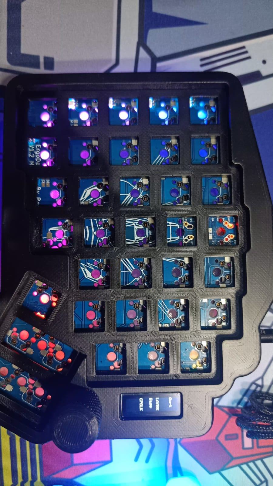
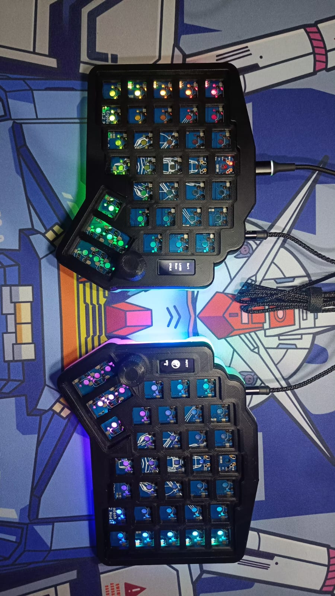

# Ergodash-Mod-QMK-VIA

## Spesification
- Arduino Pro Micro Type C as Microcontroller
- QMK Firmware
- Support VIA, all key and knob can proggrammed
- RGB Underglow
- 4x Layer 
- Hotswap Switch
- 3D Case 

## Download VIA
Link Download VIA(CHOSEE BASED YOUR OS) : https://github.com/the-via/releases/releases
VIA WEB VERSION : https://usevia.app/

## Load JSON File
or you can load manually json file like a library for detect this macropad
- Connect your macropad to PC
- Open VIA
- In Tab Setting, enable "Show Design Tab"
- Open Design Tab
- Load file with name "ErgoDash_mod_positron.json" 
- Open Configure Tab to setting your macropad
- If nothing happend , do it again from first 

## Preview Hardware

  
  
  
  

## Preview VIA

https://github.com/juarendra/Zeapad-Pro-QMK-VIA/assets/43043633/afd7e68e-0a54-4b18-be12-b96c0f13611a

## Link Keycode QMK
- mouse : https://github.com/qmk/qmk_firmware/blob/master/docs/feature_mouse_keys.md
- keyboard : https://github.com/qmk/qmk_firmware/blob/master/docs/keycodes.md

## Tutorial VIA Usage
- https://docs.keeb.io/via

## Cara Setting Knob
- For Setting Knob you just need enter the command qmk keycode, so the way is same thing with setting for ANY key like in this guide:]
[GUIDE FOR Setting ANY KEY](https://docs.keeb.io/via)

Here's some examples:

- LALT(KC_TAB) - Sends Alt-Tab
- LCTL(KC_C) - Sends Ctrl-C
- LGUI(KC_C) - Sends Cmd-C or Win-C
- LSFT(LCTL(KC_END)) - Sends Shift-Ctrl-End
- MO(1) - Momentarily turn on layer 1
- LCA(KC_DEL) - Sends Ctrl-Alt-Del
- MT(MOD_RSFT, KC_ENT) - Sends Shift if held, Enter if tapped

